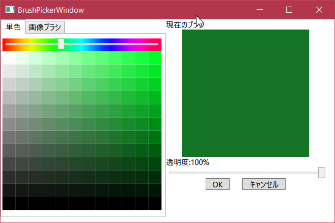

# BrushPicker (Beta ver.)  
WPFのSystem.Windows.Media.Brushを取得するカラーピッカーウィンドウです。  
基本的な使い方はMainWindow.xaml.csに書いてあります。  
実装はBrushPickerWindow.xaml.csです。  

# Usage

```C#  
var window = new BrushPickerWindow();  
if (window.ShowDialog() == true)
{
    var brush = window.NowBrush;
}

```  

# ScreenShot  
  
